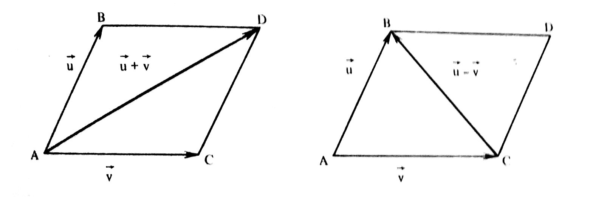

FEITOSA, M., CALLIOLI, C. A., & CAROLI, A. (1984). Matrizes, vetores e geometria analítica. *São Paulo: Nobel*.

## Capítulo 1: Matrizes

#### 1. Noção de matriz

**Matriz**: tabela $A_{m \times n}$ com elementos dispostos em $m$ linhas e $n$ colunas, $m,n \geq 1$.
$$
A_{m \times n} = 
\begin{pmatrix}
a_{11} & a_{12} & \dots & a_{1n} \\
a_{21} & a_{22} & \dots & a_{2n} \\
\vdots & \vdots & \ddots & \vdots \\
a_{m1} & a_{m2} & \dots & a_{mn} \\
\end{pmatrix}
$$
Notação: $A = (a_{ij}) (1\leq i \leq m,\ 1\leq j \leq n)$.

Igualdade: $A=B \leftrightarrow a_{ij} = b_{ij}, \forall\ i,j$.

#### 2. Adição de matriz

Sejam $A_{m \times n} = (a_{ij})$ e $B_{m \times n} = (b_{ij})$.
$$
A+B = C_{m \times n} = (c_{ij}): c_{ij} = a_{ij} + b_{ij}
$$

- Matriz nula: 
  $$
  A=(a_{ij}) : a_{ij} = 0, \forall\ i,j \Rightarrow A = \displaystyle O
  $$
  
- Matriz oposta:
  $$
  A=(a_{ij}), B=(b_{ij}): b_{ij}=-a_{ij}, \forall\ i,j \Rightarrow B=-A
  $$

- Diferença entre matrizes:
  $$
  A - B = A + (-B) = C = (c_{ij}):c_{ij} = a_{ij}-b_{ij}, \forall\ i,j
  $$

<u>Propriedades da adição</u>:

1. $A+B=B+A$ (comutativa);
2. $(A+B)+C=A+(B+C)$ (associativa);
3. $A+\displaystyle O = A$ (elemento neutro);
4. $A + (-A) = \displaystyle O$.

#### 3. Produto de um número real por uma matriz

Sejam $A=(a_{ij})$ e $t \in \R$.
$$
t A = B = (b_{ij}): b_{ij} = t \cdot a_{ij}
$$
<u>Propriedades</u>:

1. $a(bA) = (ab)A$;
2. $a(A+B)=aA+aB$;
3. $(a+b)A = aA + bA$;
4. $1 \cdot A = A$.

#### 4. Somatórias

$$
a_1 + a_2 + a_3 +\ ...\ + a_n = \sum_{i=1}^{n}a_i
$$

<u>Propriedades</u>:

1. $a\displaystyle\sum_{i=1}^{n} b_i = \sum_{i=1}^{n} ab_i$;
2. $\displaystyle\sum_{i=1}^{n} a_i + \displaystyle\sum_{i=1}^{n} b_i = \displaystyle\sum_{i=1}^{n} (a_i+b_i)$;
3. $\displaystyle\sum_{j=1}^{m} \sum_{i=1}^{n} a_i = \displaystyle\sum_{i=1}^{n} \sum_{j=1}^{m} a_i$;
4. $\bigg(\displaystyle\sum_{i=1}^{n} a_i\bigg)\bigg(\displaystyle\sum_{j=1}^{m} b_j\bigg) = \sum_{i=1}^{n}\sum_{j=1}^{m} a_i b_j$.

#### 5. Produtos de matrizes

Sejam $A_{m \times n} = (a_{ij})$ e $B_{n \times p} = (b_{jk})$.
$$
A \cdot B = C_{m \times p} = (c_{ik}): c_{ik} = \sum_{j=1}^{n} (a_{ij} \cdot b_{jk})
$$

- Matriz unidade de ordem $n$:
  $$
  I_n = (\delta_{ij}):
  \delta_{ij} =
  \begin{cases}
  1, & i=j\\
  0, & i \neq j
  \end{cases} \quad\ 1 \leq i,j \leq n
  $$

  - $\delta_{ij}$ é o [símbolo de Kronecker](https://pt.wikipedia.org/wiki/Delta_de_Kronecker).

<u>Propriedades</u>:

1. $A_{m \times n}, B_{n \times p}, C_{p \times r} \Rightarrow (AB)C = A(BC)$ (associativa);
2. $A_{m \times n}, B_{m\times n}, C_{n\times p} \Rightarrow (A+B)C = AC+BC$ (distributiva à direita);
3. $A_{n\times p}, B_{n\times p}, C_{m\times n} \Rightarrow C(A+B) = CA+CB$ (distributiva à esquerda);
4. $A_{m\times n} \Rightarrow A I_n = A = I_m A$ (elemento neutro);
5. $A_{m \times n}, B_{n\times p}, t\in \R \Rightarrow (tA)B = A(tB) = t(AB)$;
6. $O_{m \times n} \cdot A_{n \times p} = O_{m \times p}$ ;
7. $\exists\ A, B: A_{m\times n} \cdot B_{n\times p} = O_{m \times p}$.

#### 6. Matriz transposta

Sejam $A_{m \times n} = (a_{ij})$ e $B_{n \times m} = (b_{ji})$.
$$
b_{ji} = a_{ij}, \forall\ i,j \Rightarrow B = A^{t}
$$
<u>Propriedades</u>:

1. $(A+B)^{t} = A^{t} + B^{t}$;
2. $(\lambda A)^{t} = \lambda A^{t}$;
3. $(AB)^{t} = B^{t} A^{t}$;
4. $(A^{t})^{t} = A$.

- Matriz simétrica: $A^{t} = A$.

#### 7. Matrizes inversíveis

Se a *matriz quadrada* $A_{m \times m}$ é inversível, então:
$$
\exists\ B_{m \times m} : AB = BA = I_m \Rightarrow B = A^{-1}
$$

- Uma matriz inversível é dita não singular. Uma matriz não inversível é chamada singular.

- Se $A$ é inversível, sua inversa é única:
  $$
  B = B I_n = B(AB') = (BA)B' = I_n B' = B'
  $$

- Se $A$ é inversível, então, sua inversa também é inversível e $(A^{-1})^{-1} = A$.
- Se $A$ e $B$ são inversíveis, o produto é inversível e $(AB)^{-1} = B^{-1} A^{-1}$.

**Determinante**:

Cada matriz quadrada está associada a um número real chamado determinante: $\det A$.

**Complemento algébrico (ou cofator)**:

Dada a *matriz quadrada* $A_{n \times n}$, chama-se cofator $C_{ij}$ do elemento $a_{ij}$ de $A$ o produto de $(-1)^{i+j}$ pelo determinante da matriz obtida eliminando de $A$ a linha $i$ e a coluna $j$.

- $\displaystyle\sum_{j=1}^{n} a_{ij} C_{ij} = \det A$ (regra de Laplace);
- $\displaystyle\sum_{j=1}^{n} a_{ij}C_{kj} = 0 \quad (i\neq k)$;
- $\displaystyle\sum_{j=1}^{n} a_{ij} C_{kj} = \delta_{ik} \det A$ (linhas);
- $\displaystyle\sum_{j=1}^{n} a_{ji} C_{jk} = \delta_{ik} \det A$.

**Matriz adjunta**:

Seja a *matriz quadrada* $A_{m \times m} = (a_{ij})$.

Considere-se $\bar A = B = (b_{ij}): b_{ij}= C_{ij}$ (cofator).

A transposta $(\bar A)^{t}$ é dita [matriz adjunta](https://pt.wikipedia.org/wiki/Matriz_adjunta) de $A$: $(\bar A)^t = \text{adj}(A)$.

- $B = \text{adj}(A) \rightarrow AB = BA = (\det A) \cdot I_n$.
- $\det (A \cdot B) = \det A \cdot \det B$.
  - $\exists\ A^{-1} \rightarrow \det(A^{-1}) = \displaystyle\frac{1}{\det A}$.
- Para que $A$ seja inversível, é [condição suficiente e necessária](https://pt.wikipedia.org/wiki/Necessidade_e_sufici%C3%AAncia) que $\det A \neq 0$.
  - Necessária: $\det (A^{-1}) = \displaystyle\frac{1}{\det A}$;
  - Suficiente: $AB = BA = \det A \cdot I_n, \det A \neq 0 \rightarrow A^{-1} = \displaystyle\frac{1}{\det A} B$.

###### Aplicação:

$$
\begin{cases}
a_{11} x_1 + a_{12} x_2 +\ ...\ + a_{1n} x_n = b_1 \\
a_{21} x_1 + a_{22} x_2 +\ ...\ + a_{2n} x_n = b_2 \\
\dots \\
a_{n1} x_1 + a_{n2} x_2 +\ ...\ + a_{nn} x_n = b_n \\
\end{cases}
$$

pode ser escrito como:
$$
Ax=b
$$
onde:
$$
A = (a_{ij}), \quad 
x = \begin{pmatrix}
x_1 \\ x_2 \\ \vdots \\x_n
\end{pmatrix},
\quad 
b = \begin{pmatrix}
b_1 \\ b_2 \\ \vdots \\b_n
\end{pmatrix}
$$
e, sendo $A$ inversível, a solução é dada por: $x = A^{-1}b$.

## Capítulo 2: Vetores

#### 8. Segmentos orientados

**Segmento orientado**: par ordenado de pontos, origem e extremidade.

- Notação: $AB$ ($A$ é a origem, $B$ é a extremidade).
- Observações: $AB = CD \Leftrightarrow A=C \wedge B=D$.  $AB \neq BA$.

Segmento nulo: origem = extremidade. Ex.: $AA$.

Segmento oposto: $BA$ é o segmento orientado oposto a $AB$.

Comprimento: número real não negativo associado a um segmento orientado que denota o comprimento daquele segmento em determinada unidade.

- Notação: $\overline{AB}$.
- Observações: $\overline{AB} = \overline{BA}$, $\overline{AA} = 0$.

Direção e sentido:

- Sejam os segmentos não nulos $AB$ e $CD$.
  - Têm a mesma direção se $AB \parallel CD$ (paralelos).
  - Os sentidos só podem ser comparados se têm a mesma direção.
- $AB$ e $BA$ têm sentidos opostos (e mesma direção).

Segmentos equipolentes: $AB$ e $CD$ são equipolentes se têm o mesmo comprimento, a mesma direção e o mesmo sentido.

- Notação: $AB \sim CD$.
- Observações:
  - $AA \sim BB,\ \forall\ A,B$ (segmentos nulos sempre equipolentes).
  - Sejam $AB$ e $CD$ não nulos e não colineares. $AB \sim CD \equiv AB \parallel CD \wedge AC \parallel BD$ ($ABCD$ é um paralelogramo).

<u>Propriedades da equipolência</u>:

1. $AB \sim BA$ (reflexiva);
2. $AB \sim CD \rightarrow CD \sim AB$ (simétrica);
3. $AB \sim CD, CD \sim EF \Rightarrow AB \sim EF$ (transitiva);
4. Sejam o segmento orientado $AB$ e o ponto $C$, $\exists!\ D: AB \sim CD$ (transporte);
5. $AA \sim BB,\ \forall\ A,B$ ;
6. $AB \sim CD \rightarrow BA \sim DC$;
7. $AB \sim CD \rightarrow AC \sim BD$ (regra do paralelogramo).

#### 9. Vetores

Vetor determinado por um segmento orientado $AB$: conjunto de todos os segmentos orientados equipolentes a $AB$.

- Notação: $\overrightarrow{AB}$ ou $B-A$.
- Observações:
  - $\overrightarrow{AB} = \overrightarrow{CD} \leftrightarrow AB \sim CD$.
  - Os segmentos orientados equipolentes a $AB$ são *representantes* do vetor $\overrightarrow{AB}$.
  - Todos os segmentos orientados nulos, equipolentes entre si, determinam um único vetor chamado vetor nulo $\vec{0}$.
  - Seja um vetor $\vec{v} = \overrightarrow{AB}$, $\overrightarrow{BA} = -\overrightarrow{AB} = -\vec{v}$ é chamado de *vetor oposto* de $\vec{v}$. $\overrightarrow{BA}$ é representado por qualquer $DC$ tal que  $CD$ seja representante de $\overrightarrow{AB}$.

<u>Propriedades dos vetores</u>:

1. $A-A= \vec{0}$ ;
2. $-(B-A) = A-B$ ;
3. $B-A = D-C \rightarrow C-A = D-B$.

#### 10. Soma de um ponto com um vetor

Sejam um ponto $A$ e um vetor $\vec{v}$: $\exists!\ B: B-A=\vec{v}$.

$B$ chama-se soma do ponto A com o vetor $\vec{v}$: $B = A + \vec{v}$

- Observações: $A-\vec{v} = A + (-\vec{v})$.

<u>Propriedades</u>:

1. $A + \vec{0} = A$ ;
2. $(A - \vec{v}) + \vec{v} = A$ ;
3. $A + \vec{v} = B + \vec{v} \Rightarrow A = B$ ;
4. $A + \vec{v} = A +\vec{u} \Rightarrow \vec{v} = \vec{u}$ ;
5. $A + (B-A) = B$.

#### 11. Adição de vetores

Sejam $\vec{u}$, $\vec{v}$ e $A$. Considerem-se $B = A + \vec{u}$ e $C = B+\vec{u}$.

O vetor $\vec{w} = C-A = (A + \vec{u}) + \vec{v} - A= \vec{u} + \vec{v}$ não depende de $A$. $\vec{w}$ é a soma de $\vec{u}$ com $\vec{v}$.

<u>Propriedades</u>:

1. $\vec{u} + \vec{v} = \vec{v} + \vec{u}$ (comutativa);
2. $(\vec{u} + \vec{v}) + \vec{w} = \vec{u} + (\vec{v} + \vec{w})$ (associativa);
3. $\vec{u} + \vec{0} = \vec{u}$ (elemento neutro);
4. $\vec{u} + (-\vec{u}) = \vec{0}$.

- Diferença de vetores: $\vec{w} = \vec{u} + (-\vec{v}) = \vec{u} - \vec{v}$ é a diferença de $\vec{u}$ e $\vec{v}$.
- Métodos gráficos:
  - Soma: "conectada" a extremidade de $\vec{u}$  à origem de $\vec{v}$, $\vec{u} + \vec{v}$ é dado pelo vetor que tem por origem a origem de $\vec{u}$ e por extremidade a extremidade de $\vec{v}$.
  - Diferença: "conectadas" as origens de $\vec{u}$ e de $\vec{v}$, $\vec{u} + (-\vec{v}) = \vec{u} - \vec{v}$ é dado pelo vetor que tem por origem a extremidade de $\vec{v}$ e por extremidade a extremidade de $\vec{u}$.

#### 12. Módulo, direção e sentido

**Módulo**: o módulo $|\vec{v}|$ de um vetor $\vec{v}$ é o comprimento de qualquer um de seus representantes.

Direção e sentido: a direção e o sentido de $\vec{u} \neq \vec{0}$ (não nulo) são a direção e o sentido de qualquer um de seus representantes.

- Observações:
  - $\vec{u} = \vec{v}$ se e somente se têm o mesmo módulo, mesma direção e mesmo sentido.
    - Módulo, direção e sentido determinam univocamente  um vetor.
  - Vetor unitário: um vetor $\vec{v}$ é dito unitário se $|\vec{v}|=1$.
  - O *versor* de um vetor $\vec{v}\neq\vec{0}$ é o vetor unitário de mesmo sentido que $\vec{v}$.
  - Dois vetores são paralelos se têm a mesma direção ou pelo menos um deles é nulo.

#### 13. Produto de um número real por um vetor

Sejam $a \in \R^{*}$ (real não nulo) e $\vec{v}\neq\vec{0}$. O vetor $\vec{w} = a \cdot \vec{v}$, produto de $a$ e $\vec{v}$, é definido por:

1. $|\vec{w}| = |a||\vec{v}|$ ;
2. $\vec{w} \parallel \vec{v}$ (mesma direção);
3. O sentido de $\vec{w}$ é o mesmo de de $\vec{v}$, se $a > 0$, e contrário ao de $\vec{v}$, se $a<0$.

- Observações:
  - $a = 0 \vee \vec{v}=\vec{0} \rightarrow \vec{w} = a\vec{v} = \vec{0}$.
  - Se $\vec{v} \neq 0$, $\displaystyle\frac{1}{|\vec{v}|} \vec{v}$ é o versor de $ \vec{v}$.

<u>Propriedades</u>:

1. $a(b\vec{v}) = (ab)\vec{v}$ ;
2. $a (\vec{u} + \vec{v}) = a\vec{u} + a\vec{v}$ ;
3. $(a+b)\vec{u} = a\vec{u} + a\vec{v}$ ;
4. $1 \vec{v} = \vec{v}$.

**Espaço vetorial**:

"Um conjunto $V$ munido de duas operações satisfazendo as propriedades de adição de vetores/matrizes e de multiplicação de um número real por vetor/matriz é o que se chama *espaço vetorial*".

#### 14. Dependência linear

Sejam $\vec{v}_1, \vec{v}_2,...,\vec{v}_n \ (n \geq 1)$. Diz-se que eles são *linearmente dependentes* se $\exists\ a_i \neq 0 \in (a_1, a_2, ..., a_n) : \displaystyle\sum_{i=1}^{n} a_i \vec{v}_i = \vec{0}$.

- Para provar que $\vec{v}_1, \vec{v}_2,...,\vec{v}_n$ são *linearmente independentes*, basta provar $\sum a_i \vec{v}_i = \vec{0} \Rightarrow a_1=a_2=...=a_n=0$ (solução trivial).

**Combinação linear**: $\vec{v} = \sum a_i \vec{v}_i$ é dita combinação linear dos vetores $\vec{v}_i$ com coeficientes $a_i$.

<u>Teoremas</u>:

- Sejam $\vec{v}_1, \vec{v}_2,...,\vec{v}_n$. Se existe $\vec{v}_i$ que é uma combinação linear dos outros, então eles são linearmente dependentes.
- Sejam $\vec{v}_1, \vec{v}_2,...,\vec{v}_n$. Se $k\ (1 \leq k \leq n)$ desses vetores são linearmente dependentes, eles são linearmente dependentes.
- $\vec{v}$ é linearmente dependente se e somente se $\vec{v} = \vec{0}$.
- Para que dois vetores sejam linearmente dependentes, é condição necessária e suficiente que eles sejam paralelos:
  - $\vec{v} \neq 0,\ \vec{u} \parallel \vec{v} \Rightarrow \exists\ t : \vec{u} = t\vec{v}$.
- Três vetores são coplanares se podem ser representados por segmentos orientados paralelos a um mesmo plano.
  - Para que três vetores sejam linearmente dependentes, é condição necessária e suficiente que sejam coplanares.
    - Existência: se $\vec{u}$, $\vec{v}$ e $\vec{w}$ são coplanares, $\exists\ (a,b,c),\ a \neq 0 \vee b\neq0 \vee c\neq 0: a\vec{u} + b\vec{v} + c\vec{w} = 0$. Sendo que $c \neq 0$, então $\vec{w} = -\displaystyle\frac{a}{c} \vec{u}-\frac{b}{c}\vec{v}$.
    - Unicidade: $\vec{w} = m\vec{v} + n\vec{u} = m'\vec{v} + n'\vec{u} \Rightarrow (m-m')\vec{v} + (n-n')\vec{u} = \vec{0}$. Dado que  $\vec{u} \perp \vec{v}$ (linearmente independentes), estão $m-m' = 0 \wedge n-n' = 0 \Rightarrow m=m' \wedge n=n'$.
  - Se $\vec{u}$ e $\vec{v}$ são linearmente independentes, todo vetor $\vec{w}$ coplanar a $\vec{u}$ e $\vec{v}$ se exprime *de forma única* como combinação linear de $\vec{u}$ e $\vec{v}$:
    - $\exists!\ (m,n): \vec{w} = m\vec{v}+n\vec{u}$.
- Quatro vetores sempre linearmente dependentes.
  - Se $\vec{u}_1$, $\vec{u}_2$ e $\vec{u}_3$ são linearmente independentes, todo $\vec{v}$ se exprime de forma única como combinação linear de $\vec{u}_1$, $\vec{u}_2$ e $\vec{u}_3$ .
    - $\exists!\ (a_1, a_2, a_3): \vec{v} = a_1 \vec{u}_1 + a_2 \vec{u}_2 + a_3\vec{u}_3$.

#### 15. Bases

**Base no espaço**: terna $(\vec{e}_1, \vec{e}_2, \vec{e}_3)$ de vetores linearmente independentes.

**Base no plano**: tupla $(\vec{e}_1, \vec{e}_2)$ de vetores linearmente independentes.

**Base na reta**: $\vec{e} \neq \vec{0} \in r$.

Se $(\vec{e}_1, \vec{e}_2, \vec{e}_3)$ formam uma base, então todo vetor $\vec{v}$ se exprime unicamente como combinação linear de $\vec{e}_1, \vec{e}_2, \vec{e}_3$.

- $\exists!\ (a_1, a_2, a_3): \vec{v} = a_1 \vec{e}_1 + a_2 \vec{e}_2 + a_3\vec{e}_3$.

$a_1, a_2, a_3$ são *coordenadas* (ou *componentes*) de $\vec{v}$ em relação à base $(\vec{e}_1, \vec{e}_2, \vec{e}_3)$.

- $\exists!\ \vec{v} : \vec{v} = \sum a_i \vec{e}_i$.

Fixada uma base $(\vec{e}_1, \vec{e}_2, \vec{e}_3)$, costuma-se representar $\vec{v}$ por meio da terna $(a_1, a_2, a_3)$ ou da matriz-coluna $\vec{v} = \begin{pmatrix} a_1 \\ a_2 \\ a_3 \end{pmatrix}$.

<u>Teoremas</u>:

- $\vec{u} = (a_1, a_2, a_3), \vec{v} = (b_1, b_2, b_3) \Rightarrow \vec{u} + \vec{v} = (a_1+b_1, a_2+b_2, a_3+b_3)$.

- $\vec{u} = (a_1, a_2, a_3)$ e $\vec{v} = (b_1, b_2, b_3)$ são linearmente dependentes se e somente se a matriz $M =\begin{pmatrix} a_1 & a_2 & a_3 \\ b_1 & b_2 & b_3 \end{pmatrix}$ tem [característica](https://en.wikipedia.org/wiki/Rank_(linear_algebra)) (ou posto) menor do que $2$ (número de linhas).

  - Determinantes dos [menores](https://en.wikipedia.org/wiki/Minor_(linear_algebra)): $\begin{vmatrix} a_2 & a_3 \\ b_2 & b_3 \end{vmatrix} = \begin{vmatrix} a_3 & a_1 \\ b_3 & b_1 \end{vmatrix} = \begin{vmatrix} a_1 & a_2 \\ b_1 & b_2 \end{vmatrix} = 0$.
  - $\vec{u}$ e $\vec{v}$ são linearmente independentes se e somente se $M$ tem posto igual a $2$ (ou seja, um dos menores tem determinante diferente de zero).
  - Se $\vec{u}$ e $\vec{v}$ são linearmente dependentes, então $\displaystyle\frac{a_1}{b_1} = \frac{a_2}{b_2} = \frac{a_3}{b_3}\ (\vec{v}\neq \vec{0})$ (ou seja, $\vec{u}$ e $\vec{v}$ são proporcionais).

- $\vec{u} = (a_1, a_2, a_3)$, $\vec{v} = (b_1, b_2, b_3)$ e $\vec{w} = (c_1, c_2, c_3)$ são linearmente dependentes se e somente se $\det M = \begin{vmatrix} a_1 & a_2 & a_3 \\ b_1 & b_2 & b_3 \\ c_1 & c_2 & c_3 \end{vmatrix} = 0$.

  - $\vec{u}$, $\vec{v}$ e $\vec{w}$ são linearmente dependentes se e somente se $\exists (x,y,z),\ x \neq 0 \vee y \neq 0 \vee z \neq 0 : x\vec{u} + y\vec{v} + z\vec{w} = 0$.

  - Noutros termos, se somente se $x(a_1,a_2,a_3) +y(b_1, b_2,b_3) + z(c_1, c_2, c_3) = (0,0,0)$ ou se e somente se há solução não trivial para o sistema:
    $$
    \begin{cases}
    a_1 x + b_1 y + c_1 z = 0 \\
    a_2 x + b_2 y + c_2 z = 0 \\
    a_3 x + b_3 y + c_3 z = 0
    \end{cases}
    $$

  - Para que $\vec{u}$ e $\vec{v}$ e $\vec{w}$ sejam linearmente independentes é necessário e suficiente que  $\det M \neq 0$.

**Mudança de base**:

Sejam duas bases $E = (\vec{e}_1, \vec{e}_2, \vec{e}_3)$ e $F = (\vec{f}_1, \vec{f}_2, \vec{f}_3)$.

Os vetores $\vec{f}_i$ são combinações lineares dos vetores $\vec{e}_i$, ou seja:
$$
\begin{cases}
\vec{f}_1 = a_{11} \vec{e}_1 + a_{21} \vec{e}_2 + a_{31} \vec{e}_3 \\
\vec{f}_2 = a_{12} \vec{e}_1 + a_{22} \vec{e}_2 + a_{32} \vec{e}_3 \\
\vec{f}_3 = a_{13} \vec{e}_1 + a_{23} \vec{e}_2 + a_{33} \vec{e}_3
\end{cases}
$$
A matriz $A = \begin{pmatrix} a_{11} & a_{12} & a_{13} \\ a_{21} & a_{22} & a_{23} \\ a_{31} & a_{32} & a_{33} \end{pmatrix}$ chama-se *matriz de mudança de base* $E$ para base $F$.

- Note que as coordenadas de $\vec{f}_i$ aparecem como *colunas* de d $A$.
- Como $\vec{f}_1$, $\vec{f}_2$ e $\vec{f}_3$ são linear independentes, $\det A \neq 0$.
- A matriz de mudança de uma base $B$ para $B$ é a matriz unidade $I_n$.
- Seja um vetor $\vec{v}$. Considerem-se $(x_1, x_2, x_3)$ as coordenadas de $\vec{v}$ em relação à base $E$ e $(y_1, y_2, y_3)$ as coordenadas de $\vec{v}$ em relação a $F$.
  - $x_j = \displaystyle\sum_{i=1}^{3} (a_{ji} \cdot y_i),\quad j=1,2,3$.
  - $\begin{pmatrix} x_1 \\ x_2 \\ x_3 \end{pmatrix} = \begin{pmatrix} a_{11} & a_{12} & a_{13} \\ a_{21} & a_{22} & a_{23} \\ a_{31} & a_{32} & a_{33} \end{pmatrix} \begin{pmatrix} y_1 \\ y_2 \\ y_3 \end{pmatrix}$, ou seja, a matriz de coordenadas de $\vec{v}$ na base $E$ é igual ao produto da matriz de mudança de base $E$ para $F$ pela matriz das coordenadas de $\vec{v}$ em $F$.
- Sejam as bases $E$, $F$ e $G$. A matriz de mudança de base de $E$ para $G$ é igual ao produto da matriz de mudança de base de $E$ para $F$ pela matriz de mudança de base de $F$ para $G$.
- A matriz de mudança de base de $F$ para $E$ é a inversa da de $E$ para $F$.